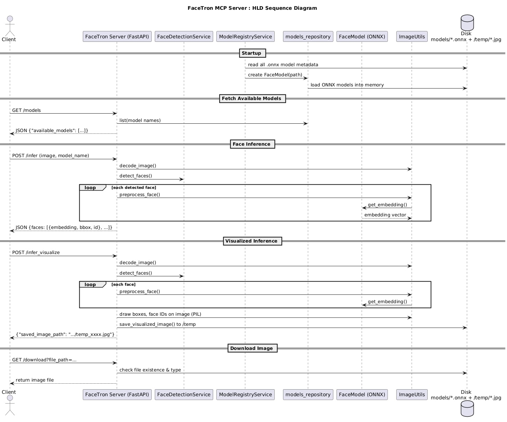
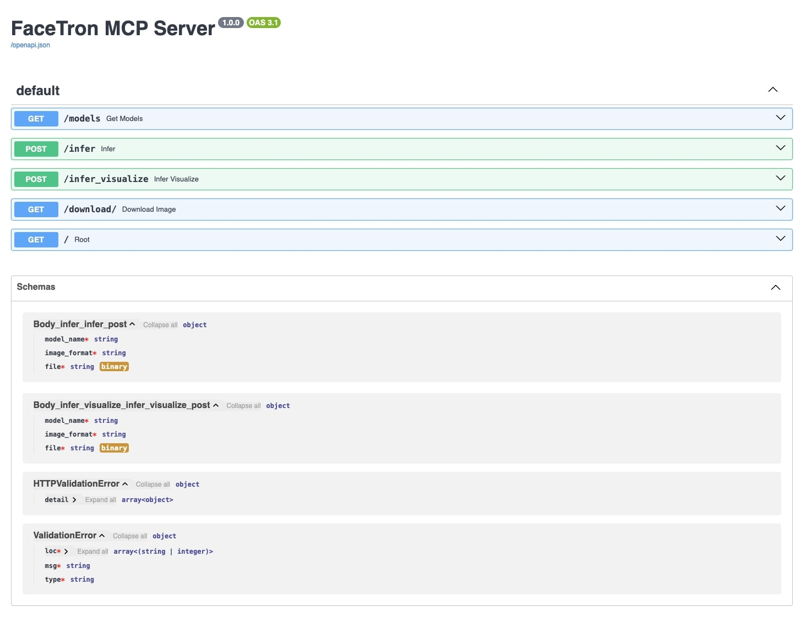
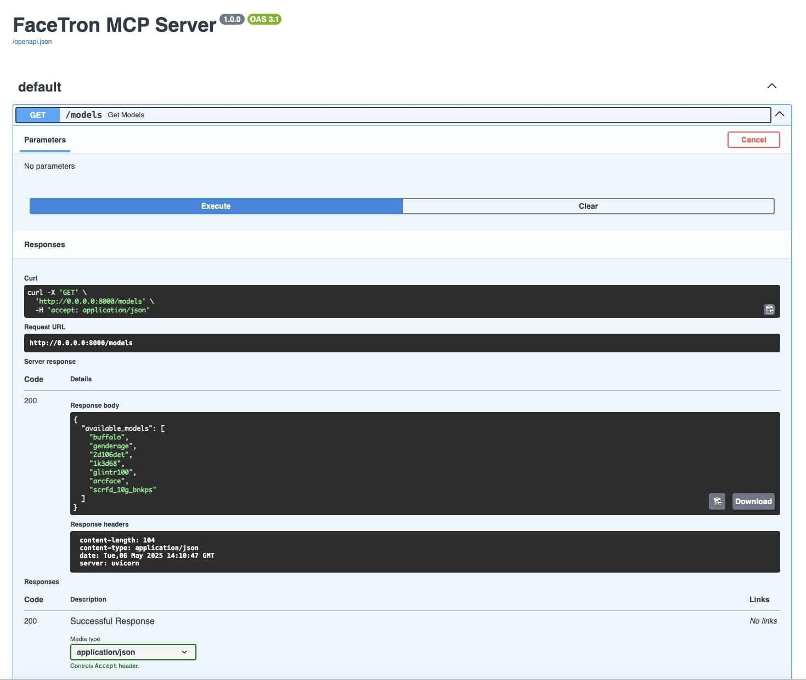
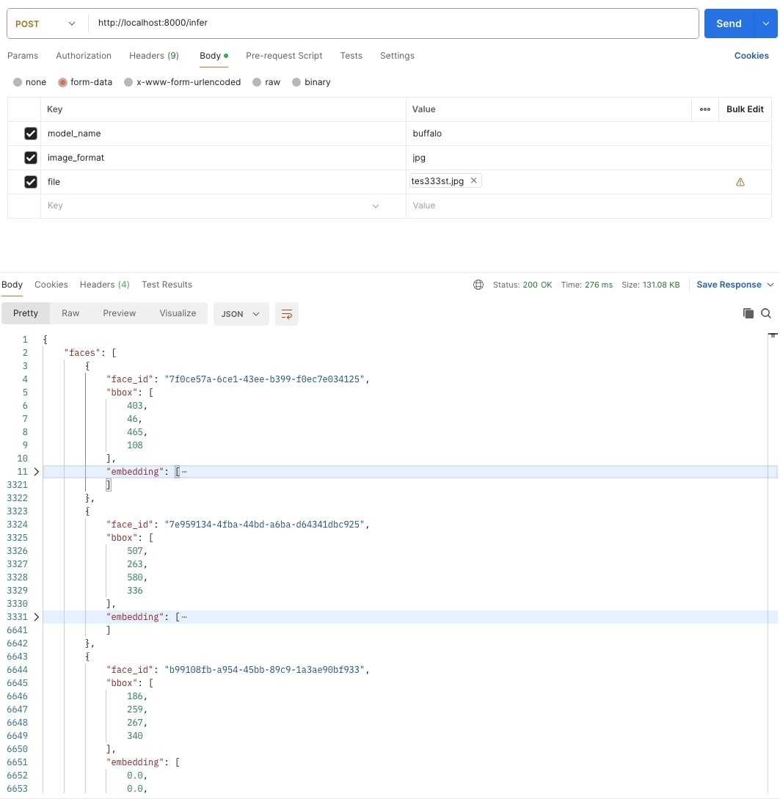
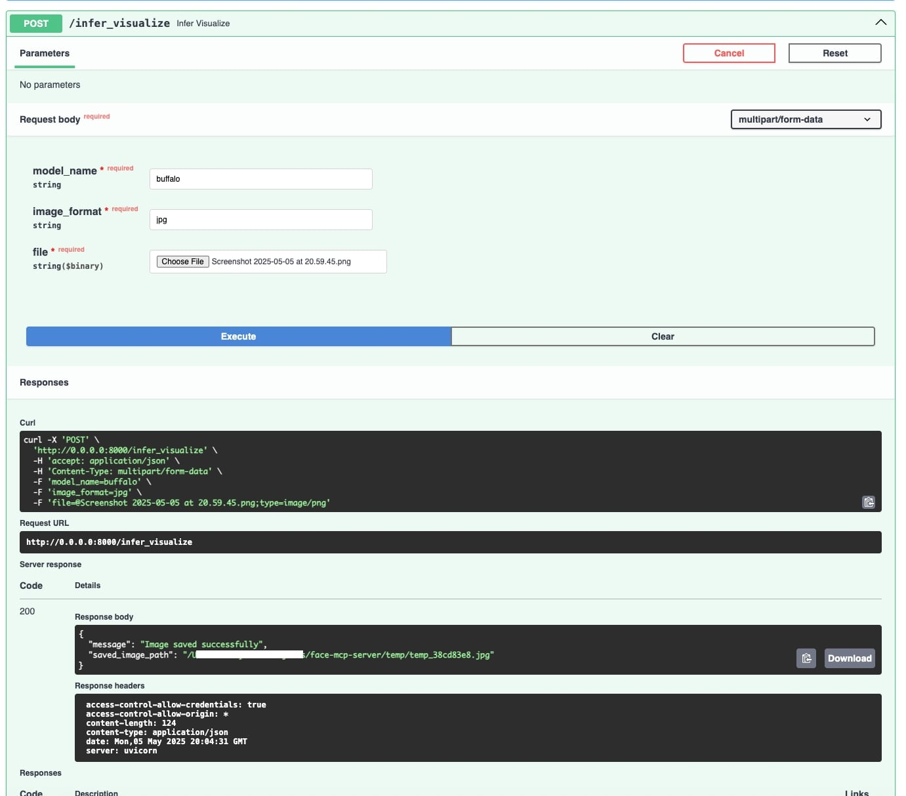
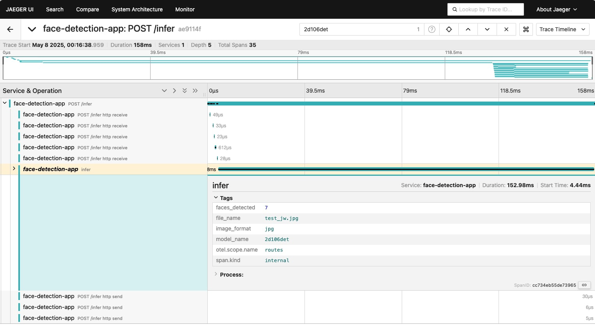
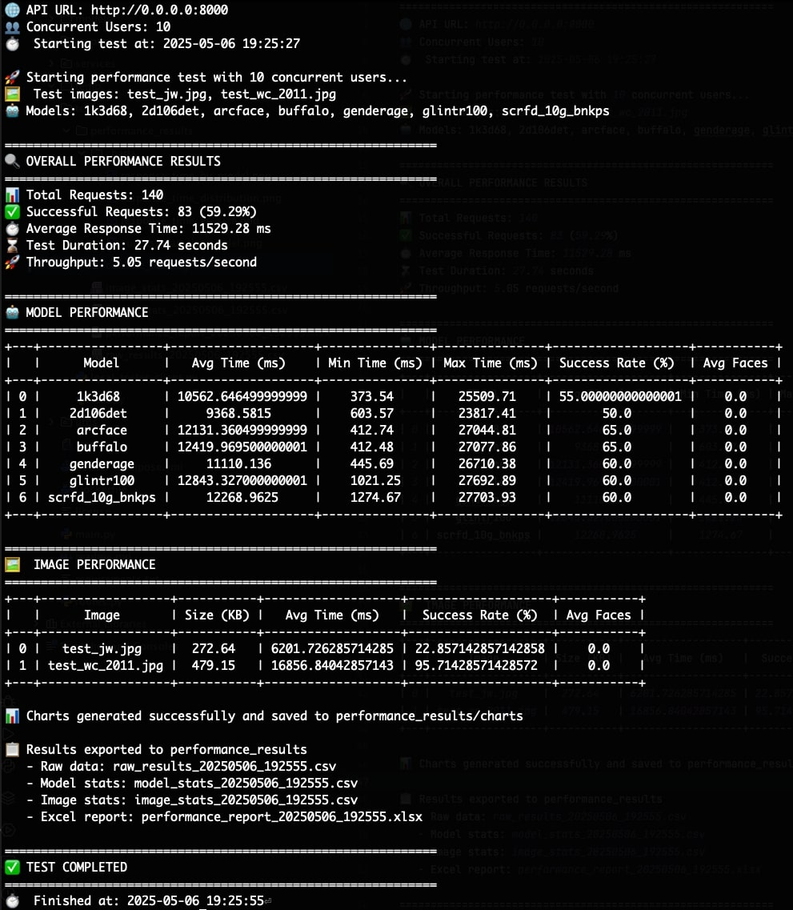

# FaceTron MCP Server
FaceTron is a high-performance, modular face(recognition) embedding server with ONNX Runtime support, featuring dynamic multi-model loading, take your models offline, built to run anywhere, from local machines to scalable cloud environments. 
It also provides an OpenAPI Specification (OAS) endpoint with MCP-compatible metadata, and with OpenTelemetry integration. 
Added lightweight ONNX models under the models/ directory for testing purposes. Replace or mount this directory with actual high-resolution face models such as 1k3d68, 2d106det, arcface, buffalo, genderage, glintr100, and scrfd_10g_bnkps for full functionality.
---

## 🚀 Features

- 🔗 APIs:
  - GET /models: Get all loaded models from registry.
  - POST /infer: Get embeddings from an image.
  - POST /infer_visualize: Get boxed image with face detection markings.
  - GET /download: Download boxed image with face detection markings.
  - GET /openapi.json: Get OpenAPI v3.1.0 JSON spec for MCP metadata.
  

- 🧠 **Face Embedding Inference**  
  Accepts face images, detects faces, and returns clean, standardized vector embeddings.
  
- 📦 **Dynamic Multi-Model Support**  
  Load multiple ONNX models (e.g., ArcFace, SCRFD, Glint360K) via `/models` with plug-and-play architecture.
  
- 🔍 **Face Detection & Visualization**  
  Returns original images with bounding boxes and aligned face crops for inference validation.

- 📚 **OpenAPI 3.1 & Swagger UI**  
  Easy integration via built-in interactive API documentation.

- 🏷️ **Out-of-the-Box OpenTelemetry Tracing**
  Integrated support for OpenTelemetry with OTLP exporter (Jaeger compatible). 
  Use setup_telemetry() in main.py to enable tracing automatically, or disable via the DISABLE_OTEL=true environment variable

- 🧩 **Future-Ready Modular Design**  
  Clean architecture with `services/`, `routes/`, and `utils/` layers—ready for:
  - TensorFlow, PyTorch runtime extension
  - Deployment into model orchestration pipelines

- 🧠 **MCP Metadata Support**  
  Exposes model info in OpenAPI spec for compliance with Model Connector Protocol (MCP) agents.

---

## 🧱 Tech Stack

- FastAPI (async web server)
- ONNX Runtime (model execution)
- Python 3.9+
- Dockerized & DevOps-ready

---

## 🗂 Project Structure

```
facetron/
├── main.py                     # FastAPI app entrypoint
├── routes.py                   # API route definitions
├── services/                   # Core face detection & embedding logic
│   ├── face_detection_service.py
│   ├── face_embedding_service.py
│   └── model_registry_service.py
├── utils/                      # Utility helpers
│   └── image_utils.py
├── models/                     # Pretrained ONNX models (test models included)
│   ├── 1k3d68.onnx
│   ├── 2d106det.onnx
│   ├── arcface.onnx
│   ├── buffalo.onnx
│   ├── genderage.onnx
│   ├── glintr100.onnx
│   └── scrfd_10g_bnkps.onnx
├── tester/                     # Client script for local testing
│   └── local_tester_client.py
├── temp/                       # Temp storage for incoming image files
├── resources/                  # Visual assets for API & architecture
│   └── *.png, *.jpg
├── requirements.txt
├── docker-compose.yml
├── Dockerfile
├── .env
├── readme.md
├── telemetry_utils.py # setup telemetry configs
└── license
```
---

## ⚙️ Setup

### 1. Clone and navigate
```bash
git clone https://github.com/13shivam/facetron.git
cd facetron
```

### 2. Add your ONNX models to `/models`
Make sure your models implement a `.get_embedding(np.ndarray) -> np.ndarray` interface via a wrapper.

---

### 3. Add/Remove OpenTelemetry Configuration
The server includes built-in OpenTelemetry, Telemetry is enabled on startup if setup_telemetry() is called in main.py. 

Disable Telemetry: Set the environment variable DISABLE_OTEL=true before starting the server and skip invoking setup_telemetry().

---

## Run with docker compose/pip

### Create `.env`

```env
PORT=8000
MODEL_DIR=/models
```

### Option 1: Start server using docker

```bash
docker-compose up -d
```

### Access APIs via Swagger
http://127.0.0.1:8000/docs#/

### Access Jaeger APIs explore trace
http://localhost:16686/search

### Option 2: Start server using pip

```bash
pip install -r requirements.txt
python main.py
...
INFO:     Will watch for changes in these directories: ['/facetron']
INFO:     Uvicorn running on http://0.0.0.0:8000 (Press CTRL+C to quit)
INFO:     Started reloader process [11385] using StatReload
INFO:     Started server process [11388]
INFO:     Waiting for application startup.
INFO:     Application startup complete.
(logs contd...)

#run tester script
python local_tester_client.py

...
200
{'message': 'Image saved successfully', 'saved_image_path': '/facetron/temp/temp_276ce9b8.jpg'}
200
{'message': 'Image saved successfully', 'saved_image_path': '/facetron/temp/temp_47179b1b.jpg'}
200
{'message': 'Image saved successfully', 'saved_image_path': '/facetron/temp/temp_feb98d6b.jpg'}
200
{'message': 'Image saved successfully', 'saved_image_path': '/facetron/temp/temp_5e4a77e5.jpg'}
...
```
---
### Sequence Diagram All APIs in test order

---
---
### Swagger view All APIs

---
---
### Get API: Get All loaded Models

---
---
### Infer API: returns map of face_ids with embeddings detected 

---
---
### Infer API Visualize: returns boxed image

---
### Jaeger Trace Visualisation

---
---
### Sample Images


---

## 🧪 Example Inference

```bash
curl --location 'http://localhost:8000/infer' --header 'Content-Type: application/json' --form 'model_name="buffalo"' --form 'image_format="jpg"' --form 'file=@"/path/to/your/image.jpg"'
```

Example response:

```json
{
    "faces": [
        {
            "face_id": "15f9b282-ea6f-43f5-a60f-0e1a3b422fcd",
            "bbox": [403, 46, 465, 108],
            "embedding": [0, 0, 3434, -343...]
        }
    ]
}
```
---
##  Performance Report

---

## 📝 License

This project is licensed under the MIT License - see the [license](license) file for details.

Important Notice Regarding Open Source Dependencies:

This project relies on various open-source models and libraries, each with its own licensing terms. It is the user's responsibility to understand and adhere to the specific licenses of all the open-source components they choose to use. Consult the individual licenses provided by the respective model and library providers.